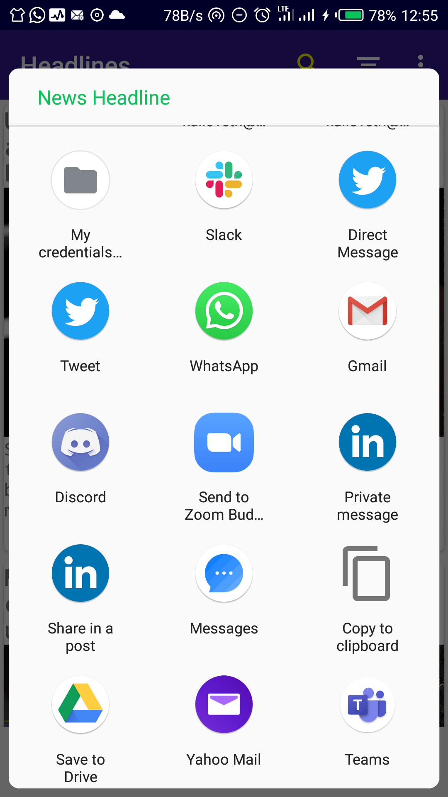

# LATESTNEWS-MVVM-JAVA
## Project Overview
This app provides you with news headlines happening around the world,with options to select specific country and news categories from [NewsApi.org](http://newsapi.org/)

## Screenshots

<table>
<tr>
<td>

 

 </td>
 <td>

 

 </td>
   <td>

  

  </td>
    <td>
    
 
  </td>
  
  </tr>
</table>

### You can get your API_KEY from [NewsApi.org](http://newsapi.org/)
# Features
* MVVM Android Architecture with Room Livedata and ViewModel
* Bottom Navigation with Jetpack Navigation Component
* Material Design Theme
* Networking with Retrofit
* ConstraintLayout
* ViewPager 2
* Users can search for any topic
* Users can check headlines from specific country or category
* User can share headline Url with friends
* User can mark a headline as Favorite and view offline

## Libraries Used
* [AndroidX](https://developer.android.com/jetpack/androidx)
* [Picasso](https://square.github.io/picasso/)
* [Retrofit](https://square.github.io/retrofit/#:~:text=Retrofit%20is%20the%20class%20through,but%20it%20allows%20for%20customization.)
* [Gson](https://github.com/google/gson)
* [Room](https://developer.android.com/topic/libraries/architecture/room#:~:text=Room%20Persistence%20Library%20Part%20of,the%20full%20power%20of%20SQLite.)
* [LiveData](https://developer.android.com/topic/libraries/architecture/livedata.html)
* [ViewModel](https://developer.android.com/topic/libraries/architecture/viewmodel)
* [ViewBinding](https://developer.android.com/topic/libraries/view-binding)
* [RxJava](https://github.com/ReactiveX/RxJava)
